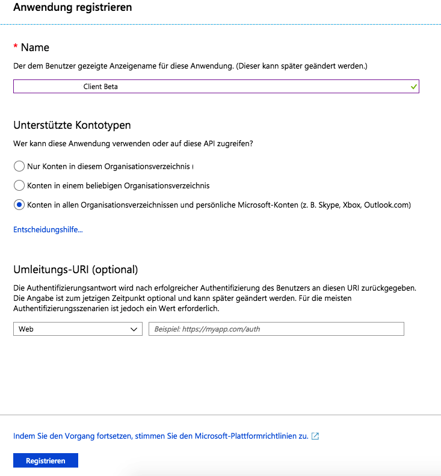

# Prototype Scala 365 Outlook Client

**Prototypes an 365 outlook client in scala**

Author: [Maximilian Bundscherer](https://bundscherer-online.de)

# Let´s get started

1. Create ``./src/main/resources/dev-application.conf`` (insert data - copy file-content from ``application.conf``)
2. Run ``sbt run``

# Included workflows

See ``Main``:

- Get user data
- Get all mails
- Send mail

# Dependencies

- Scala HTTP Client (sttp)
- Scala JSON Parser (circe)
- Scala Config-Factory (lightbend-config-factory)
- ScribeJava (OAuth Client)
- Akka HTTP and STREAMS (process OAuth-Callback)

# Configuration

- Set-up [azure app](https://portal.azure.com/) -> Azure Active Directory -> App registrations) and set ``apiKey`` in config

- Add callback-url and  and set ``callback`` in config (development: ``http://localhost:8080/processOAuthCode``)

- Add secret client key and set ``apiSecret`` in config

- Add access rights and set ``scope`` in config

